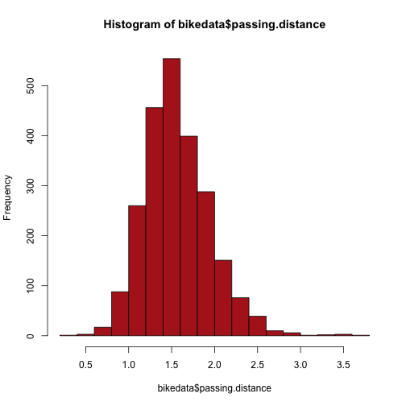
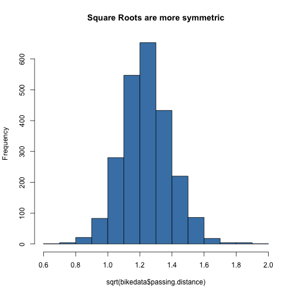

Operations and Indexing
=======================

Concatenation
-------------

You concatenate vectors using the `c` function; this is the standard way to
construct vector objects:

<pre><code class="prettyprint">x &lt;- c(1.2, 3.8, NA, 4.4, 1, 2.718)
y &lt;- c(8, 9)
z &lt;- c(x, y)</code></pre>

Recall that there are no scalars in R, so `1.2` is a length-1 vector.  The
`c` function creates a new vector by concatenating its arguments together.

Repeating
---------

The `rep` function constructs a new vector by repeating the elements of
its argument.

<pre><code class="prettyprint">rep(y, 3)</code></pre>

<pre><samp>[1] 8 9 8 9 8 9
</samp></pre>

<pre><code class="prettyprint">rep(y, each = 3)</code></pre>

<pre><samp>[1] 8 8 8 9 9 9
</samp></pre>

The first call repeats the input vector `y` three times; the second call
repeats each element of `y` three times.

Vector Operations
-----------------

Most functions in R operate on vectors, and they do so in an element-wise
fashion:

<pre><code class="prettyprint">log(x)</code></pre>

<pre><samp>[1] 0.1823 1.3350     NA 1.4816 0.0000 0.9999
</samp></pre>

<pre><code class="prettyprint">x^2</code></pre>

<pre><samp>[1]  1.440 14.440     NA 19.360  1.000  7.388
</samp></pre>

Binary operators take corresponding elements from their arguments:

<pre><code class="prettyprint">a &lt;- c(1, 0, -2, NA, 10)
b &lt;- c(2, NA, 3, 7, 4)
a + b</code></pre>

<pre><samp>[1]  3 NA  1 NA 14
</samp></pre>

<pre><code class="prettyprint">a * b</code></pre>

<pre><samp>[1]  2 NA -6 NA 40
</samp></pre>

Note that if either argument is `NA`, then the result is `NA`.

Comparison operations result in logical vectors:

<pre><code class="prettyprint">a &lt; b  # less than</code></pre>

<pre><samp>[1]  TRUE    NA  TRUE    NA FALSE
</samp></pre>

<pre><code class="prettyprint">a == b  # equal to (NOTE double equals)</code></pre>

<pre><samp>[1] FALSE    NA FALSE    NA FALSE
</samp></pre>

<pre><code class="prettyprint">a != b  # not equal to</code></pre>

<pre><samp>[1] TRUE   NA TRUE   NA TRUE
</samp></pre>

Other valid comparison operators include `<=`, `>`, and `>=`.

Application: Transforming Variables
-----------------------------------

Vector operations are useful for transforming variables.   For example,
in the original bike data, passing distance is slightly skewed to the right:

<pre><code class="prettyprint">bikedata &lt;- read.csv(&quot;bikedata.csv&quot;)
hist(bikedata$passing.distance, col = &quot;firebrick&quot;)</code></pre>

<figure class="rimage default"></figure>

We can adjust for some of this skewness by working with the square root
of passing distance:

<pre><code class="prettyprint">hist(sqrt(bikedata$passing.distance), col = &quot;steelblue&quot;, main = &quot;Square Roots are more symmetric&quot;)</code></pre>

<figure class="rimage default"></figure>

Recycling
---------
When the arguments to a vector function have unequal lengths, the elements of
the shorter argument get *recycled*.  This is useful for cases when one
argument is a element vector:

<pre><code class="prettyprint">10 - x</code></pre>

<pre><samp>[1] 8.800 6.200    NA 5.600 9.000 7.282
</samp></pre>

<pre><code class="prettyprint">x/2</code></pre>

<pre><samp>[1] 0.600 1.900    NA 2.200 0.500 1.359
</samp></pre>

Logically, the above two operations are equivalent to
`rep(10, length(x)) - x` and `x / rep(2, length(x))`.

The recycled vector can have arbitrary length, as in the example

<pre><code class="prettyprint">c(1, 2, 3, 4, 5, 6) * c(-1, 1)</code></pre>

<pre><samp>[1] -1  2 -3  4 -5  6
</samp></pre>

Recycling also works in cases where the shorter vector's length does
not divide the longer vector's, but this is considered bad programming
style, and R will issue a warning in such situations.

<pre><code class="prettyprint">c(1, 2, 3, 4, 5, 6, 7) * c(-1, 1)</code></pre>

<pre><samp>Warning: longer object length is not a multiple of shorter object length
</samp></pre>

<pre><samp>[1] -1  2 -3  4 -5  6 -7
</samp></pre>

Application: Testing the Empirical Rule
---------------------------------------

Let's using recycling and the operations we have learned so far to check if the
Empirical Rule holds for the square root of passing distance.  First we compute
the z scores.

<pre><code class="prettyprint">x &lt;- sqrt(bikedata$passing.distance)
z &lt;- (x - mean(x))/sd(x)</code></pre>

Next, we check what proportion have absolute values less than 1, 2, or 3.

<pre><code class="prettyprint">mean(abs(z) &lt;= 1)  # Empirical Rule predicts 68%...</code></pre>

<pre><samp>[1] 0.6994
</samp></pre>

<pre><code class="prettyprint">mean(abs(z) &lt;= 2)  # ...95%...</code></pre>

<pre><samp>[1] 0.9524
</samp></pre>

<pre><code class="prettyprint">mean(abs(z) &lt;= 3)  # ...and 99.7%.</code></pre>

<pre><samp>[1] 0.9936
</samp></pre>

Using the `mean` function to compute the proportion of `TRUE` values looks
unusual the first time you see it, but this is a common idiom in R.  It works
by performing the following steps:

  1. Convert `TRUE` and `FALSE` values in the input vector to `1` and `0`.
  2. Sum the elements of the converted vector.   The sum will be equal to
     the number of `TRUE` values in the original vector.
  3. Divide by the length of the vector.  This will give you the proportion
     of `TRUE` values in the original vector.

Integer Indexing
----------------

We have already seen slicing (using square brackets).  More generally, R
supports indexing by any integer vector.

<pre><code class="prettyprint">x &lt;- c(-1.1, -1, -3.2, 0.5, 0.9, 0.2, -2.1, 0.1, 0.2, 1)
x[c(3, 1, 7)]  # elements 3, 1, and 7</code></pre>

<pre><samp>[1] -3.2 -1.1 -2.1
</samp></pre>

Negative indices specify omitted elements:

<pre><code class="prettyprint">x[c(-3, -1, -7)]  # all elements but 3, 1, and 7</code></pre>

<pre><samp>[1] -1.0  0.5  0.9  0.2  0.1  0.2  1.0
</samp></pre>

You are not allowed to mix positive and negative indices:

<pre><code class="prettyprint">x[c(-3, 1, 7)]  # this is an error</code></pre>

<pre><samp>Error: only 0's may be mixed with negative subscripts
</samp></pre>

You are allowed to include `0`s in the index set, but doing so has no effect
out the output.

You can use integer indexing in a slightly different form to extract
particular rows or columns of a data frame.

<pre><code class="prettyprint">bikedata[c(2, 4, 6, 19), ]  # rows 2, 4, 6, and 19; all columns</code></pre>

<pre><samp>   vehicle colour passing.distance street helmet kerb            datetime
2      HGV    Red            0.998  Urban      N  0.5 2006-05-11 16:30:00
4      Car   &lt;NA&gt;            1.640  Urban      N  0.5 2006-05-11 16:30:00
6      Car   Grey            1.509  Urban      N  0.5 2006-05-11 16:30:00
19     Car   Grey            1.290   Main      Y  1.0 2006-05-12 07:46:00
   bikelane      city
2         N Salisbury
4         N Salisbury
6         N Salisbury
19        N Salisbury
</samp></pre>

<pre><code class="prettyprint">bikedata[c(99, 10, 3), c(2, 4)]  # rows 99, 10, 3, 12; columns 2 and 4</code></pre>

<pre><samp>   colour street
99   Grey   Main
10   &lt;NA&gt;   Main
3    Blue  Urban
</samp></pre>

Application: Top 5 Closest Passes
---------------------------------

The next code listing extracts the 5 trips with the shortest passing
distances.

<pre><code class="prettyprint">shortest &lt;- sort(bikedata$passing.distance, index.return = TRUE)$ix[1:5]
bikedata[shortest, ]</code></pre>

<pre><samp>     vehicle colour passing.distance street helmet kerb
988      Car   Blue            0.394   Main      N 0.25
2040     LGV  White            0.493  Urban      N 0.75
1906     Bus  Green            0.510  Urban      Y 0.50
1590     Car  Green            0.527   Main      Y 0.75
1043     Car   Blue            0.636   Main      N 1.25
                datetime bikelane      city
988  2006-05-20 16:21:00        N Salisbury
2040 2006-06-05 15:02:00        N   Bristol
1906 2006-06-05 13:42:00        N   Bristol
1590 2006-05-31 10:14:00        N Salisbury
1043 2006-05-26 15:18:00        N Salisbury
</samp></pre>

The explanation of the code is as follows:

  1. First, we call `sort` with `index.return=TRUE`.  This sorts the values
     returns a list with two components: a `double` vector named `x`, which
     contains the values of `bikedata$passing.distance` sorted in
     increasing order, and an integer vector named `ix`, which contains the
     indices of these values.

  2. We extract the component of the result names `ix` with the `$ix`
     operator.

  3. Then, we take elements `1:5` and store them in `shortest`.  These
     are the indices of the 5 smallest values, not the values themselves.

  4. Finally, with the command `bikedata[shortest,]`, we ask for
     the rows indicated by `shortest` and all columns of the data frame.

To get the longest passing distance, we can modify the original code,
adding `decreasing=TRUE` to the call to `sort`:

<pre><code class="prettyprint">longest &lt;- sort(bikedata$passing.distance, index.return = TRUE, decreasing = TRUE)$ix[1:5]
bikedata[longest, ]</code></pre>

<pre><samp>     vehicle colour passing.distance street helmet kerb
1059     Car   Grey            3.787  Urban      N 1.25
1946     Car  Green            3.571  Urban      N 0.25
992      Car   Blue            3.560   Main      N 0.25
1868     Car  Black            3.489  Urban      N 0.50
1187     Car    Red            3.248   Main      N 1.00
                datetime bikelane      city
1059 2006-05-26 15:18:00        N Salisbury
1946 2006-06-05 14:05:00        N   Bristol
992  2006-05-20 16:21:00        N Salisbury
1868 2006-06-05 12:37:00        N   Bristol
1187 2006-05-27 09:25:00        N Salisbury
</samp></pre>

If you want the passing distances to be in ascending order, you can use the
`rev` function to reverse the indices:

<pre><code class="prettyprint">bikedata[rev(longest), ]</code></pre>

<pre><samp>     vehicle colour passing.distance street helmet kerb
1187     Car    Red            3.248   Main      N 1.00
1868     Car  Black            3.489  Urban      N 0.50
992      Car   Blue            3.560   Main      N 0.25
1946     Car  Green            3.571  Urban      N 0.25
1059     Car   Grey            3.787  Urban      N 1.25
                datetime bikelane      city
1187 2006-05-27 09:25:00        N Salisbury
1868 2006-06-05 12:37:00        N   Bristol
992  2006-05-20 16:21:00        N Salisbury
1946 2006-06-05 14:05:00        N   Bristol
1059 2006-05-26 15:18:00        N Salisbury
</samp></pre>

Logical Indexing
----------------
We can use a logical vector to select particular elements of another vector.
To do so, the logical vector should have the same length as the original
vector.  See the following example:

<pre><code class="prettyprint">x &lt;- c(0.5, 1.7, -0.8, -1.4, 0.1, -1, -0.4, -0.8, -0.7, 1.7)
y &lt;- c(0, -1.5, -1, -1, -0.1, 0.7, 1.7, -0.2, 0.1, -0.9)
x[x &gt; 0]  # positive values of x</code></pre>

<pre><samp>[1] 0.5 1.7 0.1 1.7
</samp></pre>

<pre><code class="prettyprint">y[x &gt; 0]  # corresponding elements of y</code></pre>

<pre><samp>[1]  0.0 -1.5 -0.1 -0.9
</samp></pre>

In the above example, the expression `x > 0` evaluates to a logical vector
with the same length as `x`:

<pre><code class="prettyprint">x &gt; 10</code></pre>

<pre><samp> [1] FALSE FALSE FALSE FALSE FALSE FALSE FALSE FALSE FALSE FALSE
</samp></pre>

When we use this result as an index vector, we get back all of the elements
where the index vector is `TRUE`.

Application: Two-Sample Test
---------------------------- 
Here is a test of difference in means for the two populations: 
"square root passing distances without helmet" vs. "square root
passing distances with helmet":

<pre><code class="prettyprint">x &lt;- sqrt(bikedata$passing.distance)
h &lt;- bikedata$helmet
t.test(x[h == &quot;N&quot;], x[h == &quot;Y&quot;])</code></pre>

<pre><samp>
	Welch Two Sample t-test

data:  x[h == &quot;N&quot;] and x[h == &quot;Y&quot;]
t = 5.249, df = 2348, p-value = 1.664e-07
alternative hypothesis: true difference in means is not equal to 0
95 percent confidence interval:
 0.02039 0.04471
sample estimates:
mean of x mean of y 
    1.257     1.225 
</samp></pre>

We use logical indexing to extract the sample values drawn from
the two populations, then we compare the population means using
an unpaired t-test.

