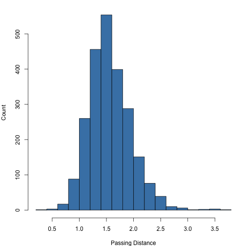
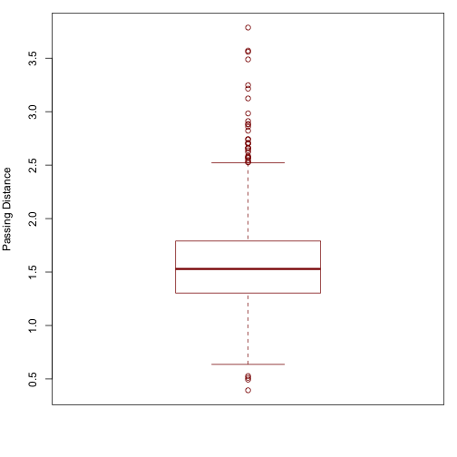
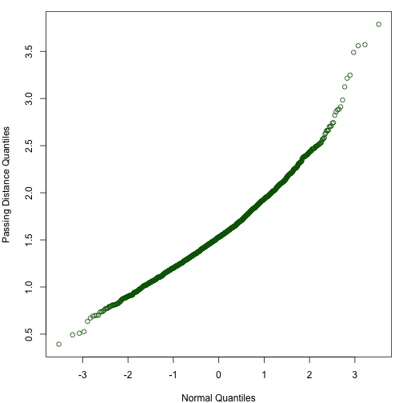
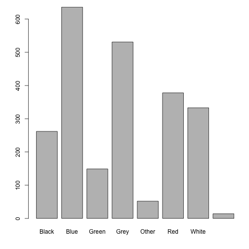
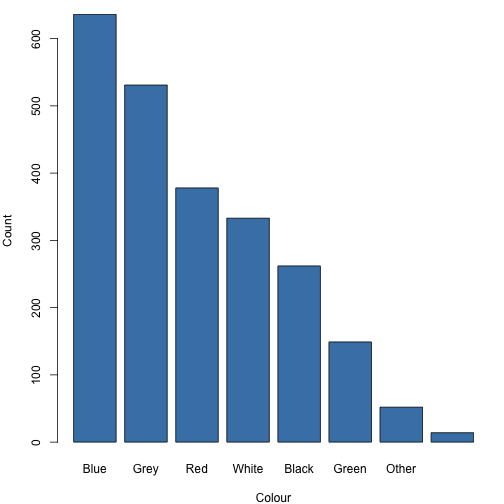

Introduction to R
=================

Preparing Data
--------------
Believe it or not, reading in data is often the hardest part of
working with R.  If you collect and store your data in Excel or
Google Docs, you will need to carefully format your spreadsheet.
It should obey the following rules:

 1. The spreadsheet should contain a single sheet.
 
 2. Row 1 should contain variable names in consecutive cells,
    starting with Cell A1.  For convenience, the names should
    be comprised of lowercase words and contain no symbols or
    punctuation.
 
 3. Subsequent rows (starting with Row 2) should contain your
    observations (data).

 4. If the value of a variable is missing for a particular
    observation, the coressponding cell in the spreadsheet should
    be empty.

 5. All other cells in the spreadsheet should be empty.
 
This sounds straightforward, but many spreadsheets that you find
"in the wild" do not obey these rules.  You will have to reformat
these spreadsheets, usually by deleting empty rows and columns
and by deleting notes and other annotations.

Even if your spreadsheet is formatted as above, R cannot open
Excel files.  To save your data to an R-compatible file format,
exportyour data as a "Column-Separated Value" (CSV) file.  You can
do this from the File menu in Excel.

Reading Data into R
-------------------
If you have a property-formatted CSV file, you can read it into R
using the `read.csv` function.  There are two ways to specify the
file.  To use your system's file chooser, run the command.

<pre><code class="prettyprint">data &lt;- read.csv(file.choose())</code></pre>
Alternatively, if you know the name of the file, you can pass it
directly to the `read.csv` function.  Note that if you pass the
file name directly, you must either specify the full path to the
file, or you must set the "working directory" to be the directory
thatcontains the file.  To set the working directory, either use
the `setwd` function or run the *Set Working Directory* command
from RStudio's **Session** menu.

Suppose that I want to open a file named "bikedata.csv", which is
stored in the "~/Datasets" directory on my system.  Ifirst set the
working directory to "~/Datasets" by Choosing
**Session** > *Set Working Directory* > *Choose Directory ...*.
This will execute the command

<pre><code class="prettyprint">setwd(&quot;~/Datasets&quot;)</code></pre>
(In fact, if I do not want to use the menu system, then I can just
type this command directly to achieve the same effect.)  Once the
working directory is set, I can read in the data to a variable
named `data` by executing the command

<pre><code class="prettyprint">bikedata &lt;- read.csv(&quot;bikedata.csv&quot;)</code></pre>

Variables
---------
In R, we use the term "variable" to refer to a name-value pair.
You should not confuse this concept with the types of variables
you have seen in your math classes (they are similar in some ways,
but different in others).

In the last section, when we ran the command
`data <- read.csv(file.choose())` we created a variable with name
`data` and value equal to the contents of the chosen file.

To create a variable or to assign a new value to an existing
variable, use the assignment command (`<-`),  which is meant to
look like an arrow pointing from the value to the variable name.
For example, the command

<pre><code class="prettyprint">a &lt;- 2.7</code></pre>
means "assign the value `2.7` to the variable named `a`".
Another way to read this is "variable `a` gets the value `2.7`".

When you have a variable, you can use the name in place of
the value:

<pre><code class="prettyprint">a + 10</code></pre>

<pre><samp>[1] 12.7
</samp></pre>

<pre><code class="prettyprint">5 * a</code></pre>

<pre><samp>[1] 13.5
</samp></pre>
You can see the value of a variable, by typing its name and
pressing enter:

<pre><code class="prettyprint">a</code></pre>

<pre><samp>[1] 2.7
</samp></pre>

An alternative way to read in a file to the variable named `data`
is to run the following sequence of commands:

<pre><code class="prettyprint">filename &lt;- file.choose()
data &lt;- read.csv(filename)</code></pre>
The first command asks the user to choose a file, and stores the
resulting name in the `filename` variable.  This variable contains
the name of the file, but not the actual contents.  The second
command takes the name of the file, opens it, reads the contents
into memory, and stores the result in the `data` variable.

Functions
---------
Besides variables, the other main concept you need to learn in
R is that of a *function*.  You are probably familiar with the
concept of a function from your mathematics courses, and a function
in R is very similar: a function is something that takes zero or more
values, then performs a sequence of actions and returns a result.

We have already seen three functions: `file.choose`, `read.csv`,
and `setwd`.  We *call* a function by putting a pair of parentheses
`()` after the function name.  Many functions, including
`read.csv` and `setwd` require one or more values as input.  We
refer to these values as *arguments*, and we specify them by
putting the values inside the parentheses.  When we do so, we
say that we are *passing the value* of the argument to the function.

Sometimes a function will have optional arguments.  These are
arguments that, if left unspecified, will be given reasonable
default values.  For example, by default, the `file.choose`
function forces the user to choose an existing file.  To allow
the user to choose a name for new file, pass the argument
`new=TRUE` to file `file.choose` function:

<pre><code class="prettyprint">file.choose(new=TRUE)</code></pre>
Before, we did not specify the `new` argument, and it defaulted
to the value `FALSE`.

Data Frames
-----------
The `read.csv` command opens the file and reads the data into a
type of object called a ``dataframe''.  Conceptually, a data frame
is just like a spreadsheet: it has columns, corresponding to
variables, and rows, corresponding to observations.  Each row and
column has a name.  Usually, the row names are the character
strings "1", "2", etc., but this is not always the case.

To see the first 6 rows in the `bikedata` data frame, run the
command

<pre><code class="prettyprint">head(bikedata)</code></pre>

<pre><samp>  vehicle colour passing.distance street helmet kerb            datetime
1     Car   Blue            2.114  Urban      N  0.5 2006-05-11 16:30:00
2     HGV    Red            0.998  Urban      N  0.5 2006-05-11 16:30:00
3     LGV   Blue            1.817  Urban      N  0.5 2006-05-11 16:30:00
4     Car   &lt;NA&gt;            1.640  Urban      N  0.5 2006-05-11 16:30:00
5     Bus  Other            1.544  Urban      N  0.5 2006-05-11 16:30:00
6     Car   Grey            1.509  Urban      N  0.5 2006-05-11 16:30:00
  bikelane      city
1        N Salisbury
2        N Salisbury
3        N Salisbury
4        N Salisbury
5        N Salisbury
6        N Salisbury
</samp></pre>
We can see that there are nine columns, named `vehicle`,
`colour`, `passing.distance`, `street`, `helmet`, `kerb`,
`datetime`, `bikelane`, and `city`.

To see a summary of the entire data frame, use the ``summary`` function:

<pre><code class="prettyprint">summary(bikedata)</code></pre>

<pre><samp> vehicle         colour    passing.distance         street     helmet  
 Bus :  46   Blue   :636   Min.   :0.394    Main       :1637   N:1206  
 Car :1708   Grey   :531   1st Qu.:1.303    OneWay1    :   9   Y:1149  
 HGV :  82   Red    :378   Median :1.529    OneWay2    :  13           
 LGV : 293   White  :333   Mean   :1.564    Residential:  39           
 PTW :  34   Black  :262   3rd Qu.:1.790    Rural      :   2           
 SUV : 143   (Other):201   Max.   :3.787    Urban      : 655           
 Taxi:  49   NA's   : 14                                               
      kerb                     datetime    bikelane        city     
 Min.   :0.25   2006-05-20 16:21:00:  93   N:2305   Bristol  : 450  
 1st Qu.:0.25   2006-05-20 15:48:00:  75   Y:  50   Salisbury:1905  
 Median :0.50   2006-05-31 09:04:00:  70                            
 Mean   :0.67   2006-05-20 15:34:00:  65                            
 3rd Qu.:1.00   2006-05-27 10:01:00:  64                            
 Max.   :1.25   2006-05-27 09:25:00:  63                            
                (Other)            :1925                            
</samp></pre>

Extracting Columns
------------------
Let's say we want to investigate the `passing.distance` variable.
To do this, we must first *extract* that column from the
`bikedata` dataframe.  There are three ways to do this:

<pre><code class="prettyprint">x &lt;- bikedata$passing.distance
x &lt;- bikedata[[&quot;passing.distance&quot;]]
x &lt;- bikedata[,&quot;passing.distance&quot;]</code></pre>
All three commands are equivalent ways to extract the
`passing.distance` column and store it in a variable named `x`.
The `$` form is the most common, but you will sometimes see the
other two forms, as well.

Vectors
-------
Data frame columns are stored in a data type called a "vector".
Conceptually, a vector is a one-dimensional array of values,
indexed by integers starting at `1`.  Most functions in R operate
on vectors.

You can access individual values by using  double square-brackets.
For example, to see the first element of the vector, type the
command

<pre><code class="prettyprint">x[[1]]</code></pre>

<pre><samp>[1] 2.114
</samp></pre>
To see the fifth value, type the command

<pre><code class="prettyprint">x[[5]]</code></pre>

<pre><samp>[1] 1.544
</samp></pre>
To see how many elements are contained in the vector, use the
`length` function:

<pre><code class="prettyprint">length(x)</code></pre>

<pre><samp>[1] 2355
</samp></pre>
To see the last element, type

<pre><code class="prettyprint">x[[length(x)]]</code></pre>

<pre><samp>[1] 1.031
</samp></pre>

To extract a subvector, use single square brackets.  For example,
the subvector consisting of the first 25 elements is

<pre><code class="prettyprint">x[1:25]</code></pre>

<pre><samp> [1] 2.114 0.998 1.817 1.640 1.544 1.509 1.290 1.512 1.049 1.932 1.145
[12] 1.410 1.428 1.494 1.570 2.103 0.896 1.160 1.290 1.963 2.436 2.304
[23] 1.482 1.492 1.432
</samp></pre>
Here, `1:25` is shorthand for "integers 1 to 25".  Since not all
25 values fit onto a single line, R wraps the values.  At the
start of each line, R prints the index of the first value on the
line in square brackets.  Looking at the output above, we can
see that `1.410` is the 12th element and `1.492` is the 24th
element of the result.

You may have asked yourself earlier why the output of `x[[1]]`
and other similar commands was prefixed by `[1]`.  The reason for
this is that R doesn't have the concept of a "single value" or
"scalar".  The only way to represent the value of `x[[1]]` is
as a length-one vector.  The output

<pre><samp>[1] 2.114
</samp></pre>

denotes a vector with a single value (`2.114`), stored at
index `1`.

Since there is no concept of a "scalar" in R, the command
`x[[1]]` is equivalent to `x[1:1]`, which is also the same as
`x[1]`.  In other programming languages, `x[[1]]`,
"the first element of `x`", and `x[1]`, "the subvector of `x`
starting and ending at index `1`" would be different; in R, these 
are identical.  Because of this, most people use single brackets
instead of double brackets when indexing vectors, writing
`x[1]` and `x[5]` instead of `x[[1]]` and `x[[5]]]`.

Descriptive Statistics for Numeric Variables
--------------------------------------------
There are a variety of functions for computing descriptive
statistics for the values stored in a vector.

  * Sum of values:
    
    <pre><code class="prettyprint">sum(x)</code></pre>
    
    
    
    <pre><samp>[1] 3683
    </samp></pre>

  * Measures of central tendency (sample mean and median):
    
    <pre><code class="prettyprint">mean(x)</code></pre>
    
    
    
    <pre><samp>[1] 1.564
    </samp></pre>
    
    
    
    <pre><code class="prettyprint">median(x)</code></pre>
    
    
    
    <pre><samp>[1] 1.529
    </samp></pre>

  * Measures of variability (sample standard deviation and sample
    variance):
    
    <pre><code class="prettyprint">sd(x)</code></pre>
    
    
    
    <pre><samp>[1] 0.3835
    </samp></pre>
    
    
    
    <pre><code class="prettyprint">var(x)</code></pre>
    
    
    
    <pre><samp>[1] 0.147
    </samp></pre>

  * Extreme values (minimum and maximum):
    
    <pre><code class="prettyprint">min(x)</code></pre>
    
    
    
    <pre><samp>[1] 0.394
    </samp></pre>
    
    
    
    <pre><code class="prettyprint">max(x)</code></pre>
    
    
    
    <pre><samp>[1] 3.787
    </samp></pre>

  * Quantiles:
    
    <pre><code class="prettyprint">quantile(x, .25) # first quartile</code></pre>
    
    
    
    <pre><samp>  25% 
    1.303 
    </samp></pre>
    
    
    
    <pre><code class="prettyprint">quantile(x, .75) # third quartile</code></pre>
    
    
    
    <pre><samp> 75% 
    1.79 
    </samp></pre>
    
    
    
    <pre><code class="prettyprint">quantile(x, .99) # 99th percentile</code></pre>
    
    
    
    <pre><samp> 99% 
    2.58 
    </samp></pre>

Plots for Numeric Variables
---------------------------
We can use the `hist` command to make a histogram of the values
stored in a vector:

<pre><code class="prettyprint">hist(x)</code></pre>

<figure class="rimage default"></figure>

By default, the output looks fine when printed in black and white,
but it isn't very pretty.  We can specify the bin color, change the axis
labels, and omit the main title by passing additional arguments to this
`hist` function

<pre><code class="prettyprint">hist(x, col=&quot;steelblue&quot;, xlab=&quot;Passing Distance&quot;, ylab=&quot;Count&quot;,
     main=&quot;&quot;)</code></pre>

<figure class="rimage default"></figure>

Use the `boxplot` and `qqnorm` commands to make boxplots and
normal probability plots, as in the following examples:

<pre><code class="prettyprint">boxplot(x, border=&quot;darkred&quot;, ylab=&quot;Passing Distance&quot;)</code></pre>

<figure class="rimage default"></figure>

<pre><code class="prettyprint">qqnorm(x, col=&quot;darkgreen&quot;, xlab=&quot;Normal Quantiles&quot;,
       ylab=&quot;Passing Distance Quantiles&quot;,
       main=&quot;&quot;)</code></pre>

<figure class="rimage default"></figure>

Categorical Variables
---------------------
So far, we have seen how to use R to summarize and plot a numeric
(quantitative) variable.  R also has very good support for
categorical (qualitative) variables, referred to as *factors*.

To see levels, the set of possible values for a factor variable,
use the `levels` function.  For example, to see the levels of
the `colour` variable:

<pre><code class="prettyprint">levels(bikedata$colour)</code></pre>

<pre><samp>[1] &quot;Black&quot; &quot;Blue&quot;  &quot;Green&quot; &quot;Grey&quot;  &quot;Other&quot; &quot;Red&quot;   &quot;White&quot;
</samp></pre>

To tabulate the values of the variable, use the `table` command,
as in

<pre><code class="prettyprint">table(bikedata$colour)</code></pre>

<pre><samp>
Black  Blue Green  Grey Other   Red White 
  262   636   149   531    52   378   333 
</samp></pre>
Note: be default, the `table` command omits missing values.  To
include these values in the output, include `useNA="ifany"` in
the call to `table`:

<pre><code class="prettyprint">table(bikedata$colour, useNA=&quot;ifany&quot;)</code></pre>

<pre><samp>
Black  Blue Green  Grey Other   Red White  &lt;NA&gt; 
  262   636   149   531    52   378   333    14 
</samp></pre>

We can present tabulated counts in a bar plot using the following
commands

<pre><code class="prettyprint">tab &lt;- table(bikedata$colour, useNA=&quot;ifany&quot;)
barplot(tab)</code></pre>

<figure class="rimage default"></figure>

Usually, it makes sense to arrange the table values in decreasing
order.  Here is an example with sorted counts that adds axis
labels and changes the bar colors:

<pre><code class="prettyprint">barplot(sort(tab, decreasing=TRUE), xlab=&quot;Colour&quot;, ylab=&quot;Count&quot;,
        col=&quot;steelblue&quot;)</code></pre>

<figure class="rimage default"></figure>

Inference for a Population Mean
-------------------------------
We can use the `t.test` function to test a hypothesis
about a population mean.

<pre><code class="prettyprint">t.test(bikedata$passing.distance)</code></pre>

<pre><samp>
	One Sample t-test

data:  bikedata$passing.distance
t = 197.9, df = 2354, p-value &lt; 2.2e-16
alternative hypothesis: true mean is not equal to 0
95 percent confidence interval:
 1.548 1.579
sample estimates:
mean of x 
    1.564 
</samp></pre>
This reports the t statistic, the degrees of freedom, the p-value,
and the sample mean.  The command also reports a 95% confidence
interval for the population mean.  To change the confidence level,
use the `conf.level` argument, as in

<pre><code class="prettyprint">t.test(bikedata$passing.distance, conf.level=0.99)</code></pre>

<pre><samp>
	One Sample t-test

data:  bikedata$passing.distance
t = 197.9, df = 2354, p-value &lt; 2.2e-16
alternative hypothesis: true mean is not equal to 0
99 percent confidence interval:
 1.544 1.584
sample estimates:
mean of x 
    1.564 
</samp></pre>

By default, the null hypothesis is that the true (population)
mean is equal to 0, and the alternative hypothesis is that the
true mean is not equal to 0.  To use a different null, pass the
`mu` argument.  To use a different alternative, pass
`alternative="less"` or `alternative="greater"`.  For example, to
test the null hypothesis that the true mean is equal to 1.5
against the alternative that it is greater, run the command

<pre><code class="prettyprint">t.test(bikedata$passing.distance, alternative=&quot;greater&quot;, mu=1.5)</code></pre>

<pre><samp>
	One Sample t-test

data:  bikedata$passing.distance
t = 8.088, df = 2354, p-value = 4.786e-16
alternative hypothesis: true mean is greater than 1.5
95 percent confidence interval:
 1.551   Inf
sample estimates:
mean of x 
    1.564 
</samp></pre>
Note that for a one-sided alternative, the confidence interval
is one-sided, as well.

Inference for a Population Proportion
-------------------------------------
To perform a test on a population proportion, use the `prop.test`
function.  This performs a test on a population proportion that is
slightly different than the one we cover in the core statistics
course, but it will give you a very similar answer.

In the first argument, specify `x`, the number of successes; in
the second argument, specify `n`, the number of trials.  By
default, the null value of the population proportion is `0.5`; to
specify a different value, use the `p` argument.

For example, to test the null hypothesis that the true proportion
of cars passing the rider on his route is exactly equal to 40%,
we first tabulate the `colour` variable,

<pre><code class="prettyprint">table(bikedata$colour)</code></pre>

<pre><samp>
Black  Blue Green  Grey Other   Red White 
  262   636   149   531    52   378   333 
</samp></pre>
In this instance, the number of "successes" is equal to the number
of blue cars, `636`.  Recall that some of the values for the
`colour` variable are missing.  If the missingness is unrelated to
the actual color, then we can safely ifnore these values; in this
case, the number of "trials" is equal to the sumof the counts for
all of the non-missing values.

<pre><code class="prettyprint">sum(table(bikedata$colour))</code></pre>

<pre><samp>[1] 2341
</samp></pre>
Now, to test the proportion, we run the command:

<pre><code class="prettyprint">prop.test(636, 2341, p=0.40)</code></pre>

<pre><samp>
	1-sample proportions test with continuity correction

data:  636 out of 2341, null probability 0.4
X-squared = 160.1, df = 1, p-value &lt; 2.2e-16
alternative hypothesis: true p is not equal to 0.4
95 percent confidence interval:
 0.2538 0.2903
sample estimates:
     p 
0.2717 
</samp></pre>

As with the `t.test` function, we can use a one-sided alternative
or specify a different confidence level for the interval by
using the `alternative` or `conf.level` argument, respectively.
Here is a test of the null that the true proportion is equal to
`0.5` against the alternative that it is less, along with a
one-sided 99% confidence interval:

<pre><code class="prettyprint">prop.test(636, 2341, p=0.50, alternative=&quot;less&quot;, conf.level=0.99)</code></pre>

<pre><samp>
	1-sample proportions test with continuity correction

data:  636 out of 2341, null probability 0.5
X-squared = 487.2, df = 1, p-value &lt; 2.2e-16
alternative hypothesis: true p is less than 0.5
99 percent confidence interval:
 0.0000 0.2938
sample estimates:
     p 
0.2717 
</samp></pre>
