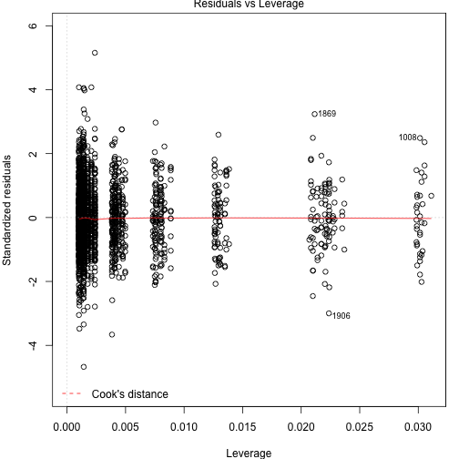

Linear Regression
=================

Fit a linear regression model with response variable
`sqrt(passing.distance)` and predictors `helmet`, `vehicle`,
and `kerb`.  This includes an intercept by default.

<pre><code class="prettyprint">bikedata &lt;- read.csv(&quot;bikedata.csv&quot;)
model &lt;- lm(sqrt(passing.distance) ~ helmet + vehicle + kerb,
            data = bikedata)</code></pre>

Get the coefficient estimates, their standard errors, t statistics,
and p values.

<pre><code class="prettyprint">summary(model)</code></pre>

<pre><samp>
Call:
lm(formula = sqrt(passing.distance) ~ helmet + vehicle + kerb, 
    data = bikedata)

Residuals:
    Min      1Q  Median      3Q     Max 
-0.6761 -0.0932 -0.0063  0.0882  0.7455 

Coefficients:
            Estimate Std. Error t value Pr(&gt;|t|)    
(Intercept)  1.21756    0.02204   55.26  &lt; 2e-16 ***
helmetY     -0.02255    0.00603   -3.74  0.00019 ***
vehicleCar   0.11207    0.02164    5.18  2.4e-07 ***
vehicleHGV   0.04895    0.02674    1.83  0.06726 .  
vehicleLGV   0.09134    0.02299    3.97  7.3e-05 ***
vehiclePTW   0.09773    0.03275    2.98  0.00287 ** 
vehicleSUV   0.11193    0.02456    4.56  5.4e-06 ***
vehicleTaxi  0.06884    0.02977    2.31  0.02083 *  
kerb        -0.10326    0.00850  -12.15  &lt; 2e-16 ***
---
Signif. codes:  0 '***' 0.001 '**' 0.01 '*' 0.05 '.' 0.1 ' ' 1

Residual standard error: 0.145 on 2346 degrees of freedom
Multiple R-squared:  0.0906,	Adjusted R-squared:  0.0875 
F-statistic: 29.2 on 8 and 2346 DF,  p-value: &lt;2e-16
</samp></pre>

Check regression assumptions with diagnostic plots.

<pre><code class="prettyprint">plot(model)</code></pre>

<figure class="rimage default"></figure><figure class="rimage default"></figure><figure class="rimage default"></figure><figure class="rimage default"></figure>

Scatter plot of standardized residuals versus `kerb`.

<pre><code class="prettyprint">plot(bikedata$kerb, rstandard(model))</code></pre>

<figure class="rimage default"></figure>

Boxplots of standardized residuals versus `helmet`

<pre><code class="prettyprint">boxplot(rstandard(model) ~ bikedata$helmet)</code></pre>

<figure class="rimage default"></figure>

99% confidence interval for coefficient of `helmetY`.

<pre><code class="prettyprint">confint(model, &quot;helmetY&quot;, 0.99)</code></pre>

<pre><samp>           0.5 %    99.5 %
helmetY -0.03809 -0.007009
</samp></pre>

